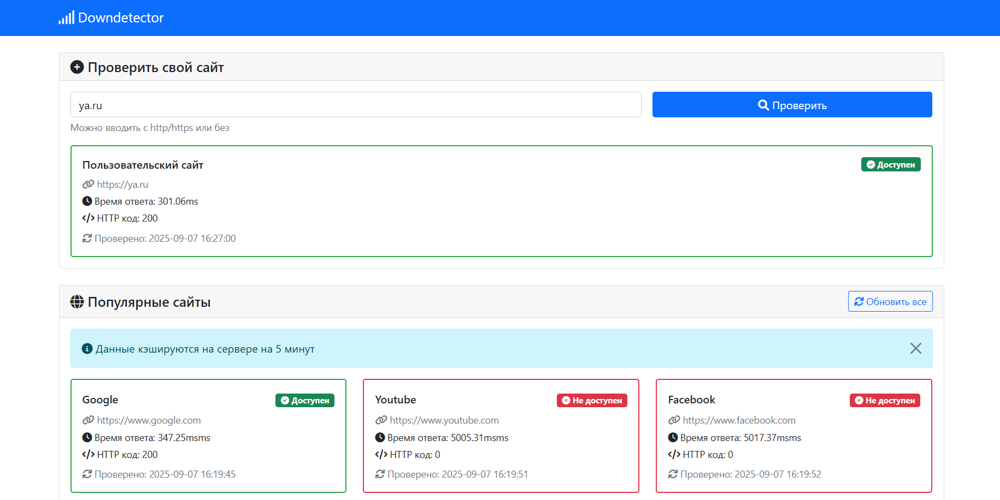

# Downdetector
Инструмент для проверки доступности веб-сайтов с серверным кэшированием.

## ⚡ Особенности
- Проверка доступности сайтов
- Серверное кэширование (5 минут)
- Стильный интерфейс Bootstrap 5
- Поэтапная проверка с анимацией
- Предустановленные популярные сайты
- MVC архитектура

## 🚀 Быстрый старт

### Требования
- PHP 7.4+
- Веб-сервер (Apache/Nginx)
- cURL extension

### Установка
1. Разместить файлы на веб-сервере
2. Настроить права на папку `cache/`
3. Открыть в браузере
